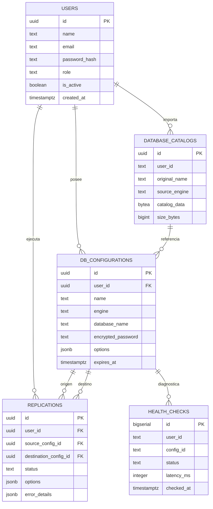

**UNIVERSIDAD PRIVADA DE TACNA**

**FACULTAD DE INGENIERIA**

**Escuela Profesional de Ingenieria de Sistemas**

**Diccionario de Datos**

**Drop Nexus - Replicador de Datos entre Bases de Datos**

Curso: *Base de Datos II*

Docente: *Patrick Cuadros Quiroga*

Integrantes:

***Vincenzo Rafael Llanos Niño***

***VICTOR JOSEPH PLATERO MARON***

**Tacna - Peru**

***2026***

\pagebreak

Sistema *Drop Nexus - Replicador de Datos entre Bases de Datos*

Diccionario de Datos

Version *1.0*

| CONTROL DE VERSIONES | | | | | |
|:---:|:---|:---|:---|:---:|:---|
| Version | Hecha por | Revisada por | Aprobada por | Fecha | Motivo |
| 1.0 | VLLN, VJPM | VLLN, VJPM | P. Cuadros Q. | 2026-07-07 | Diccionario fisico, logico y de contratos API alineado a la carpeta `web` |

# INDICE GENERAL

1. [Introduccion](#1-introduccion)
2. [Convenciones](#2-convenciones)
3. [Mapa de estructuras](#3-mapa-de-estructuras)
4. [Persistencia principal](#4-persistencia-principal)
5. [Diccionario fisico de tablas](#5-diccionario-fisico-de-tablas)
6. [Modelos logicos y contratos internos](#6-modelos-logicos-y-contratos-internos)
7. [Contratos de API REST](#7-contratos-de-api-rest)
8. [Endpoints principales](#8-endpoints-principales)
9. [Reglas de integridad, seguridad y retencion](#9-reglas-de-integridad-seguridad-y-retencion)
10. [Trazabilidad con el codigo](#10-trazabilidad-con-el-codigo)

# 1. Introduccion

Drop Nexus es una aplicacion web multiusuario para importar bases de datos o archivos,
previsualizar sus esquemas y ejecutar replicas por lotes entre origen y destino. La
persistencia propia del sistema se almacena en PostgreSQL/Supabase y se complementa con
catalogos comprimidos de archivos importados.

Este diccionario documenta:

- las tablas fisicas de metadatos creadas por el backend;
- los modelos logicos usados por servicios y adaptadores;
- los contratos JSON de autenticacion, configuraciones, esquemas, salud, asistente y replica;
- las reglas de integridad y seguridad aplicadas al ciclo de datos.

No se documentan las tablas internas de las bases externas del usuario, porque cambian en
cada importacion. Esas estructuras se representan mediante modelos de catalogo y esquema.

# 2. Convenciones

| Simbolo | Significado |
|---|---|
| Si | Campo obligatorio |
| No | Campo opcional |
| Cond. | Obligatorio segun contexto |
| PK | Llave primaria |
| FK | Llave foranea |
| UTC | Fecha y hora en tiempo universal |
| JSONB | Objeto JSON almacenado en PostgreSQL |
| Secreto | Dato que no debe exponerse al cliente |
| Derivado | Valor calculado por consulta o servicio |

# 3. Mapa de estructuras

## 3.1. Modelo entidad-relacion de metadatos

## 3.2. Ciclo de vida de una base importada

```mermaid
flowchart LR
    A["Archivo local: SQLite, SQL, JSON, NDJSON, XLSX, CSV o BAK"] --> B["Validacion de extension y tamano"]
    B --> C["Extraccion de tablas y columnas"]
    C --> D["Catalogo normalizado FileCatalog"]
    D --> E["Compresion gzip"]
    E --> F["database_catalogs.catalog_data"]
    F --> G["db_configurations.database_name = catalog-db://<id>"]
    G --> H["Replicacion y exportacion"]
    H --> I["Eliminacion por expiracion o borrado manual"]
```

# 4. Persistencia principal

| Atributo | Valor |
|---|---|
| Motor | PostgreSQL administrado, normalmente Supabase |
| Configuracion | Variable `DATABASE_URL` |
| Inicializacion | Funcion `initializeDatabase()` |
| Extension PostgreSQL | `pgcrypto` para `gen_random_uuid()` |
| Pool | Maximo 10 conexiones, timeout de conexion 5000 ms |
| SSL | Activo en produccion, Supabase o URL con `sslmode` |
| Retencion de configuraciones | 24 horas desde `created_at` |
| Catalogos de archivo | JSON normalizado comprimido en `database_catalogs.catalog_data` |
| Datos originales subidos | Temporales; se eliminan al terminar la importacion |

# 5. Diccionario fisico de tablas

## 5.1. Tabla `users`

Almacena usuarios de la aplicacion y datos basicos de autenticacion.

| Campo | Tipo | Obligatorio | Clave | Valor por defecto | Regla / descripcion |
|---|---|:---:|:---:|---|---|
| `id` | `uuid` | Si | PK | `gen_random_uuid()` | Identificador interno del usuario |
| `name` | `text` | Si |  |  | Nombre visible |
| `email` | `text` | Si | UQ |  | Correo normalizado a minusculas en registro/login |
| `password_hash` | `text` | Si |  |  | Hash bcrypt de la contrasena |
| `role` | `text` | Si |  | `'user'` | Rol logico: `user` o `admin` |
| `is_active` | `boolean` | Si |  | `true` | Permite bloquear acceso sin borrar usuario |
| `last_login_at` | `timestamptz` | No |  |  | Ultimo inicio de sesion exitoso |
| `login_count` | `integer` | Si |  | `0` | Numero de inicios de sesion |
| `created_at` | `timestamptz` | Si |  | `now()` | Fecha de creacion |
| `updated_at` | `timestamptz` | Si |  | `now()` | Fecha de ultima modificacion |

Indices:

| Indice | Columnas | Proposito |
|---|---|---|
| `users_pkey` | `id` | Busqueda por identificador |
| `users_email_key` | `email` | Unicidad directa |
| `idx_users_email_unique` | `lower(email)` | Evitar duplicados por mayusculas/minusculas |
| `idx_users_activity` | `last_login_at`, `created_at` | Panel administrativo y actividad |

## 5.2. Tabla `db_configurations`

Representa una base importada o configuracion de conexion asociada a un usuario.

| Campo | Tipo | Obligatorio | Clave | Valor por defecto | Regla / descripcion |
|---|---|:---:|:---:|---|---|
| `id` | `uuid` | Si | PK | `gen_random_uuid()` | Identificador de configuracion |
| `user_id` | `uuid` | Si | FK |  | Referencia a `users(id)` con borrado en cascada |
| `name` | `text` | Si |  |  | Nombre asignado por el usuario |
| `engine` | `text` | Si |  |  | Motor: `postgresql`, `mysql`, `mariadb`, `sqlserver`, `oracle`, `sqlite`, `mongodb`, `excel` |
| `host` | `text` | No |  |  | Host si la conexion es externa |
| `port` | `integer` | No |  |  | Puerto si la conexion es externa |
| `database_name` | `text` | No |  |  | Nombre/ruta logica; para archivo usa `catalog-db://<id>` |
| `username` | `text` | No |  |  | Usuario externo |
| `encrypted_password` | `text` | No | Secreto |  | Contrasena cifrada con AES-256-GCM |
| `options` | `jsonb` | Si |  | `'{}'::jsonb` | Opciones: `storageMode`, `connectionStringEncrypted`, metadatos |
| `created_at` | `timestamptz` | Si |  | `now()` | Fecha de creacion |
| `updated_at` | `timestamptz` | Si |  | `now()` | Ultima modificacion |
| `expires_at` | `timestamptz` | Si |  | `now() + interval '24 hours'` | Vencimiento de bases importadas |

Indices:

| Indice | Columnas | Proposito |
|---|---|---|
| `idx_db_configurations_user_id` | `user_id` | Listado por usuario |
| `idx_db_configurations_expires_at` | `expires_at` | Limpieza de configuraciones vencidas |

Reglas:

- Un usuario puede mantener hasta 10 configuraciones activas.
- Las respuestas publicas ocultan `password`, `encrypted_password`, `database_name` y `connectionString`.
- Una configuracion expirada no se lista ni se usa para nuevas replicas.

## 5.3. Tabla `replications`

Almacena trabajos de replica, su progreso, programacion y diagnostico de errores.

| Campo | Tipo | Obligatorio | Clave | Valor por defecto | Regla / descripcion |
|---|---|:---:|:---:|---|---|
| `id` | `uuid` | Si | PK | `gen_random_uuid()` | Identificador del job |
| `user_id` | `uuid` | Si | FK |  | Usuario propietario |
| `source_config_id` | `uuid` | Si | FK |  | Configuracion origen |
| `destination_config_id` | `uuid` | Si | FK |  | Configuracion destino |
| `source_table` | `text` | Si |  |  | Tabla/coleccion origen |
| `destination_table` | `text` | Si |  |  | Tabla/coleccion destino |
| `status` | `text` | Si |  | `'stopped'` | `starting`, `running`, `scheduled`, `stopped`, `completed`, `failed` |
| `records_copied` | `bigint` | Si |  | `0` | Registros escritos correctamente |
| `lag_seconds` | `integer` | Si |  | `0` | Estimacion de atraso restante |
| `last_error` | `text` | No |  |  | Ultimo error tecnico |
| `started_at` | `timestamptz` | No |  |  | Inicio del job |
| `stopped_at` | `timestamptz` | No |  |  | Detencion o fin operativo |
| `created_at` | `timestamptz` | Si |  | `now()` | Creacion del registro |
| `updated_at` | `timestamptz` | Si |  | `now()` | Ultima actualizacion |
| `group_id` | `uuid` | Si |  | `gen_random_uuid()` | Agrupa replicas multi-tabla |
| `options` | `jsonb` | Si |  | `'{}'::jsonb` | Opciones del job |
| `total_records` | `bigint` | No |  |  | Total estimado de registros origen |
| `failed_records` | `bigint` | Si |  | `0` | Registros rechazados |
| `current_offset` | `bigint` | Si |  | `0` | Offset persistente para reanudar |
| `current_batch` | `integer` | Si |  | `0` | Lote actual |
| `speed_rows_per_second` | `numeric` | Si |  | `0` | Rendimiento calculado |
| `retry_count` | `integer` | Si |  | `0` | Reintentos acumulados |
| `completed_at` | `timestamptz` | No |  |  | Fecha de completado |
| `next_run_at` | `timestamptz` | No |  |  | Proxima ejecucion programada |
| `error_details` | `jsonb` | Si |  | `'[]'::jsonb` | Detalle de lotes rechazados |
| `failure_stage` | `text` | No |  |  | Etapa donde fallo |
| `failure_code` | `text` | No |  |  | Codigo diagnosticado |
| `failure_cause` | `text` | No |  |  | Causa legible |
| `recommendation` | `text` | No |  |  | Recomendacion de correccion |

Indices:

| Indice | Columnas | Proposito |
|---|---|---|
| `idx_replications_user_status` | `user_id`, `status` | Historial y tablero por estado |
| `idx_replications_group_id` | `group_id` | Seguimiento de replicas multi-tabla |
| `idx_replications_next_run` | `next_run_at` | Scheduler de replicas programadas |

## 5.4. Tabla `health_checks`

Registra diagnosticos de conexion y salud por configuracion.

| Campo | Tipo | Obligatorio | Clave | Valor por defecto | Regla / descripcion |
|---|---|:---:|:---:|---|---|
| `id` | `bigserial` | Si | PK | Autoincremental | Identificador del diagnostico |
| `user_id` | `text` | Si |  |  | Usuario propietario en formato texto |
| `config_id` | `text` | Si |  |  | Configuracion diagnosticada en formato texto |
| `status` | `text` | Si |  |  | Estado del diagnostico |
| `latency_ms` | `integer` | Si |  |  | Latencia medida en milisegundos |
| `read_rows_per_second` | `numeric` | No |  |  | Rendimiento de lectura si aplica |
| `error` | `text` | No |  |  | Error publico del diagnostico |
| `checked_at` | `timestamptz` | Si |  | `now()` | Fecha del diagnostico |

Indice:

| Indice | Columnas | Proposito |
|---|---|---|
| `idx_health_checks_config_time` | `config_id`, `checked_at DESC` | Historial reciente por configuracion |

## 5.5. Tabla `database_catalogs`

Almacena catalogos de archivos importados cuando el entorno no debe depender de disco persistente.

| Campo | Tipo | Obligatorio | Clave | Valor por defecto | Regla / descripcion |
|---|---|:---:|:---:|---|---|
| `id` | `uuid` | Si | PK | `gen_random_uuid()` | Identificador del catalogo |
| `user_id` | `text` | Si |  |  | Usuario propietario |
| `original_name` | `text` | Si |  |  | Nombre original del archivo |
| `source_engine` | `text` | Si |  |  | Motor del archivo normalizado |
| `catalog_data` | `bytea` | Si |  |  | JSON `FileCatalog` comprimido con gzip |
| `size_bytes` | `bigint` | Si |  | `0` | Tamano del catalogo comprimido |
| `created_at` | `timestamptz` | Si |  | `now()` | Fecha de creacion |
| `updated_at` | `timestamptz` | Si |  | `now()` | Ultima actualizacion |

Indice:

| Indice | Columnas | Proposito |
|---|---|---|
| `idx_database_catalogs_user_id` | `user_id` | Validar propiedad de catalogos |

# 6. Modelos logicos y contratos internos

## 6.1. `DbConfiguration`

| Campo | Tipo | Obligatorio | Descripcion |
|---|---|:---:|---|
| `id` | `string` | Si | UUID de configuracion |
| `userId` | `string` | Si | Usuario propietario |
| `name` | `string` | Si | Nombre visible |
| `engine` | `DbEngine` | Si | Motor soportado |
| `host` | `string` | No | Host externo |
| `port` | `number` | No | Puerto externo |
| `database` | `string` | No | Base/ruta/catalogo |
| `username` | `string` | No | Usuario externo |
| `password` | `string` | No | Solo interno; se oculta en respuesta publica |
| `options` | `Record<string, unknown>` | No | Opciones tecnicas |
| `createdAt` | `string` | Si | ISO date |
| `updatedAt` | `string` | Si | ISO date |
| `expiresAt` | `string` | Si | ISO date |

## 6.2. `FileCatalog`

Representa una base importada y normalizada.

| Campo | Tipo | Obligatorio | Descripcion |
|---|---|:---:|---|
| `version` | `1` | Si | Version del contrato |
| `sourceEngine` | `DbEngine` | Si | Motor detectado/importado |
| `originalName` | `string` | Si | Nombre del archivo subido |
| `tables` | `CatalogTable[]` | Si | Tablas, hojas o colecciones normalizadas |

## 6.3. `CatalogTable`

| Campo | Tipo | Obligatorio | Descripcion |
|---|---|:---:|---|
| `name` | `string` | Si | Nombre de tabla/coleccion/hoja |
| `columns` | `ColumnSchema[]` | Si | Columnas detectadas |
| `rows` | `Record<string, unknown>[]` | Si | Datos normalizados para replica |

## 6.4. `ColumnSchema`

| Campo | Tipo | Obligatorio | Descripcion |
|---|---|:---:|---|
| `name` | `string` | Si | Nombre de columna |
| `dataType` | `string` | Si | Tipo original o inferido |
| `nullable` | `boolean` | Si | Permite nulos |
| `primaryKey` | `boolean` | Si | Participa como clave primaria |
| `foreignKey` | `boolean` | Si | Participa como clave foranea |
| `defaultValue` | `string \| null` | No | Valor por defecto detectado |

## 6.5. `ReplicationRequest`

Contrato usado por `POST /api/replications/preview` y `POST /api/replications/start`.

| Campo | Tipo | Obligatorio | Valor por defecto | Regla |
|---|---|:---:|---|---|
| `sourceConfigId` | `string` | Si |  | Identificador de origen |
| `destinationConfigId` | `string` | Si |  | Identificador de destino |
| `sourceTable` | `string` | Cond. |  | Requerido si no se usa `tables` |
| `destinationTable` | `string` | Cond. |  | Requerido si no se usa `tables` |
| `tables` | `TableMapping[]` | Cond. |  | 1 a 100 tablas |
| `columnMappings` | `ColumnMapping[]` | No | `[]` | Maximo 500 mapeos |
| `createDestination` | `boolean` | No | `false` | Permite crear tabla destino |
| `writeMode` | `insert \| upsert \| replace \| truncate` | No | `insert` | Modo de escritura |
| `batchSize` | `number` | No | `1000` | Entre 100 y 10000 |
| `maxRetries` | `number` | No | `3` | Entre 0 y 10 |
| `incremental` | `boolean` | No | `true` | Mantiene offset entre ejecuciones |
| `scheduleMinutes` | `number` | No |  | Entre 5 y 43200 minutos |

## 6.6. `TableMapping`

| Campo | Tipo | Obligatorio | Regla |
|---|---|:---:|---|
| `sourceTable` | `string` | Si | 1 a 255 caracteres |
| `destinationTable` | `string` | Si | 1 a 255 caracteres |
| `columnMappings` | `ColumnMapping[]` | No | Maximo 500 |

## 6.7. `ColumnMapping`

| Campo | Tipo | Obligatorio | Regla |
|---|---|:---:|---|
| `source` | `string` | Si | Columna origen |
| `destination` | `string` | Si | Columna destino |
| `transform` | `none \| string \| number \| boolean \| date \| json` | No | `none` por defecto |

## 6.8. Archivo `.nexus-flow.json`

Contrato generado por la extension de VS Code para documentar flujos de replica.

| Campo | Tipo | Obligatorio | Descripcion |
|---|---|:---:|---|
| `version` | `string` | Si | Version del archivo |
| `kind` | `database-nexus-flow` | Si | Tipo de artefacto |
| `name` | `string` | Si | Nombre del flujo |
| `source` | `object` | Si | Origen logico |
| `destination` | `object` | Si | Destino logico |
| `tables` | `array` | Si | Tablas, modo de escritura y mapeos |
| `validation` | `object` | No | Reglas de verificacion previa |
| `evidence` | `object` | No | Metadatos de evidencia tecnica |

# 7. Contratos de API REST

## 7.1. Registro de usuario

`POST /api/auth/register`

| Campo | Tipo | Obligatorio | Regla |
|---|---|:---:|---|
| `name` | `string` | Si | 2 a 100 caracteres |
| `email` | `string` | Si | Email valido, maximo 254 |
| `password` | `string` | Si | 6 a 128 caracteres |

Respuesta: `{ user, token }`.

## 7.2. Inicio de sesion

`POST /api/auth/login`

| Campo | Tipo | Obligatorio | Regla |
|---|---|:---:|---|
| `email` | `string` | Si | Email valido |
| `password` | `string` | Si | 1 a 128 caracteres |

Respuesta: `{ user, token }` con JWT valido por 7 dias.

## 7.3. Crear configuracion desde archivo importado

`POST /api/configurations`

| Campo | Tipo | Obligatorio | Regla |
|---|---|:---:|---|
| `name` | `string` | Si | 2 a 100 caracteres |
| `engine` | `DbEngine` | Si | Motor soportado |
| `database` | `string` | Si | Debe referenciar un catalogo propio |
| `options.storageMode` | `fileCatalog` | Si | Requerido por la implementacion actual |

## 7.4. Subir archivo de base

`POST /api/configurations/database-upload/:engine`

| Campo | Tipo | Obligatorio | Regla |
|---|---|:---:|---|
| `file` | `multipart file` | Si | Campo multipart debe llamarse `file` |
| `engine` | `DbEngine` | Si | Determina extensiones permitidas |

Extensiones admitidas por motor:

| Motor | Extensiones |
|---|---|
| `sqlite` | `.db`, `.sqlite`, `.sqlite3` |
| `mongodb` | `.json`, `.ndjson` |
| `excel` | `.xlsx`, `.xls`, `.csv` |
| `sqlserver` | `.sql`, `.bak` |
| Otros SQL | `.sql` |

## 7.5. Chat del asistente

`POST /api/assistant/chat`

| Campo | Tipo | Obligatorio | Regla |
|---|---|:---:|---|
| `message` | `string` | Si | 1 a 2000 caracteres |
| `section` | `replication \| configurations` | Si | Contexto del dashboard |

## 7.6. Respuesta de reporte de replica

`GET /api/replications/:id/report`

Devuelve la fila completa de `replications` para el usuario autenticado, incluyendo:

- progreso (`records_copied`, `current_offset`, `current_batch`);
- diagnostico (`failure_stage`, `failure_code`, `failure_cause`, `recommendation`);
- detalle de errores por lote (`error_details`).

# 8. Endpoints principales

| Metodo | Ruta | Autenticacion | Descripcion |
|---|---|:---:|---|
| `POST` | `/api/auth/register` | No | Crear usuario |
| `POST` | `/api/auth/login` | No | Iniciar sesion |
| `GET` | `/api/auth/me` | Si | Usuario autenticado |
| `GET` | `/api/users/profile` | Si | Perfil del usuario |
| `GET` | `/api/configurations` | Si | Listar configuraciones vigentes |
| `POST` | `/api/configurations/database-upload/:engine` | Si | Importar archivo |
| `POST` | `/api/configurations` | Si | Crear configuracion desde catalogo |
| `PATCH` | `/api/configurations/:id` | Si | Actualizar configuracion |
| `DELETE` | `/api/configurations/:id` | Si | Eliminar configuracion y jobs asociados |
| `POST` | `/api/configurations/:id/test` | Si | Probar conexion |
| `GET` | `/api/configurations/:id/export/:format` | Si | Exportar como `xlsx`, `sqlite` o `json` |
| `GET` | `/api/configurations/:id/tables` | Si | Listar tablas del motor |
| `GET` | `/api/schema/:configId` | Si | Obtener esquema normalizado |
| `GET` | `/api/schema/:configId/data/:table` | Si | Datos paginados de una tabla |
| `GET` | `/api/schema/:configId/statistics/:table` | Si | Estadisticas de tabla |
| `GET` | `/api/schema/:configId/compare/:destinationId` | Si | Comparar esquemas |
| `GET` | `/api/schema/:configId/export/documentation/:format` | Si | Exportar documentacion `html` o `markdown` |
| `GET` | `/api/schema/:configId/export/json` | Si | Exportar base normalizada en JSON |
| `GET` | `/api/schema/:configId/export/excel` | Si | Exportar base normalizada en Excel XML |
| `GET` | `/api/schema/:configId/export/csv/:table` | Si | Exportar tabla como CSV |
| `GET` | `/api/replications` | Si | Listar replicas |
| `POST` | `/api/replications/preview` | Si | Validar y previsualizar replica |
| `POST` | `/api/replications/start` | Si | Crear job de replica |
| `POST` | `/api/replications/:id/stop` | Si | Detener job |
| `POST` | `/api/replications/:id/resume` | Si | Continuar job detenido o fallido |
| `POST` | `/api/replications/:id/retry` | Si | Reintentar desde cero |
| `GET` | `/api/replications/:id/report` | Si | Descargar/revisar reporte |
| `GET` | `/api/health` | Si | Estado general por configuracion |
| `POST` | `/api/health/:configId/diagnose` | Si | Diagnosticar conexion |
| `GET` | `/api/health/:configId/history` | Si | Historial de salud |
| `POST` | `/api/assistant/chat` | Si | Chat contextual del asistente |

# 9. Reglas de integridad, seguridad y retencion

## 9.1. Integridad

- `users.id` controla la propiedad de configuraciones, replicas y catalogos.
- `db_configurations.user_id` y `replications.user_id` aplican aislamiento por usuario.
- `replications.source_config_id` y `replications.destination_config_id` deben existir en `db_configurations`.
- No se permite replicar una tabla sobre si misma usando el mismo origen y destino.
- `ReplicationRequest.tables` exige al menos una tabla efectiva.
- `batchSize` se limita entre 100 y 10000 registros.
- `maxRetries` se limita entre 0 y 10.
- `scheduleMinutes` se limita entre 5 y 43200 minutos.

## 9.2. Seguridad

- El JWT expira en 7 dias.
- Las rutas privadas usan middleware `authenticate`.
- Las contrasenas de usuarios se guardan como hash bcrypt.
- Las credenciales externas se cifran antes de persistir.
- Las respuestas publicas de configuracion no devuelven contrasenas ni connection strings.
- Los identificadores de tabla se validan para evitar caracteres nulos y nombres peligrosos.
- La aplicacion usa consultas parametrizadas para valores.
- Los archivos subidos validan nombre, extension, tamano y contenido minimo.

## 9.3. Retencion y limpieza

- Las configuraciones importadas expiran despues de 24 horas.
- Al eliminar una configuracion se eliminan replicas asociadas y health checks de esa configuracion.
- Los archivos originales subidos se usan temporalmente y se eliminan al terminar la importacion.
- En produccion, el catalogo persistente vive en `database_catalogs` comprimido con gzip.
- Las replicas en estado `starting` o `running` se reanudan al reiniciar el backend.

# 10. Trazabilidad con el codigo

| Elemento documentado | Archivo fuente |
|---|---|
| Creacion de tablas e indices | `web/backend/src/db/database.ts` |
| Usuarios, roles y JWT | `web/backend/src/routes/auth.ts`, `web/backend/src/services/userService.ts` |
| Configuraciones de base | `web/backend/src/routes/configurations.ts`, `web/backend/src/services/dbConfigService.ts` |
| Importacion y catalogos | `web/backend/src/services/fileCatalog.ts` |
| Esquemas y exportaciones | `web/backend/src/routes/schema.ts`, `web/backend/src/services/schemaExtractor.ts` |
| Validacion de replicas | `web/backend/src/validations/replicationValidation.ts` |
| Ejecucion de replicas | `web/backend/src/services/replicationService.ts` |
| Diagnostico de salud | `web/backend/src/routes/health.ts`, `web/backend/src/services/healthService.ts` |
| Chat asistente | `web/backend/src/routes/assistant.ts`, `web/backend/src/services/assistantService.ts` |
| Tipos compartidos | `web/backend/src/types/index.ts` |
| Extension VS Code y flujos `.nexus-flow.json` | `web/vscode-extension/extension.js`, `web/vscode-extension/flowTemplate.js`, `web/vscode-extension/fileAnalysis.js` |

